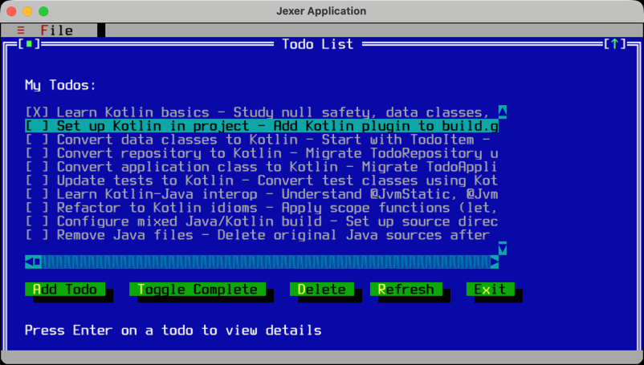

# Kotlin JUnit Sample

Tutorial: [Test code using JUnit in JVM](https://kotlinlang.org/docs/jvm-test-using-junit.html)

Configuration guides: [Maven](maven.md) | [Gradle](gradle.md)

A sample project demonstrating how to write tests in Kotlin for Java applications. This project shows how to add a Kotlin test for testing Java source code.

## Getting Started



### Prerequisites

- Java 17 or higher

### Running Tests

Using Maven:
```bash
cd initial  # or cd complete
./mvnw test
```

Using Gradle:
```bash
cd initial  # or cd complete
./gradlew test
```

## Project Structure

This repository contains two versions of the same project:

```
kotlin-junit-sample/
├── initial/          # Starting point with Java tests
│   ├── src/
│   │   ├── main/java/    # Java source code
│   │   └── test/java/    # JUnit test in Java
│   ├── pom.xml           # Maven configuration
│   └── build.gradle.kts  # Gradle configuration
│
└── complete/         # Final version with Kotlin tests
    ├── src/
    │   ├── main/java/    # Same Java source code
    │   └── test/java/    # Same JUnit test in Java, new test in Kotlin
    ├── pom.xml           # Maven with Kotlin support
    └── build.gradle.kts  # Gradle with Kotlin plugin
```

### Application Code

Both projects contain a simple Todo application with:

- **TodoItem** − a Java class representing a todo item with title, description, completion status, and timestamps
- **TodoRepository** − a Java repository class for managing todo items in memory

### Test Code

- **initial/**: Contains a JUnit 5 test written in Java for the `TodoItem` class
- **complete/**: Contains an additional Kotlin test for the `TodoRepository` class, demonstrating idiomatic Kotlin testing patterns

## Technologies

- **Java**: 17
- **Kotlin**: 2.3.20 (test code only in the `complete` version)
- **JUnit**: 6.0.3
- **Build Tools**: Maven and Gradle (both supported)
- **UI Library**: Jexer 1.6.0 (terminal UI library)
